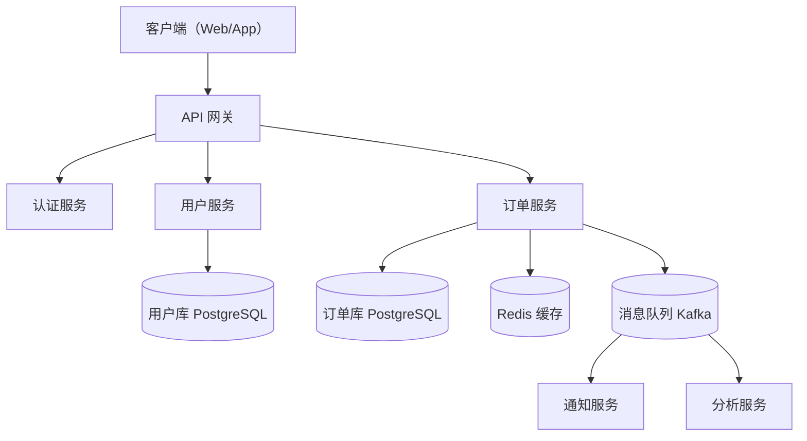

# 架构顾问

系统架构设计与优化顾问，支持全新系统设计和现有架构分析，输出 Mermaid 架构图和可执行路线图。

## 安装

```bash
npx skills add <username>/expert-coding-skills --path skills/architecture-advisor
```

## 使用方式

```
/架构分析
```

或：

```
/architecture
```

## 两种场景

### 全新系统设计

1. 需求澄清（规模、可用性、技术栈偏好）
2. 2-3 个架构方案对比（含 Mermaid 图）
3. 用户选择后深化设计
4. 输出 MVP → 目标架构的演进路线

### 现有架构优化

1. 探索代码库，还原架构现状图
2. 识别问题点（可扩展性、可靠性、耦合度）
3. 分优先级输出优化建议
4. 输出分阶段优化路线图

## 输出示例



## 关注的架构维度

| 维度 | 检查内容 |
|------|----------|
| 可扩展性 | 单点瓶颈、水平扩展能力 |
| 可靠性 | 单点故障、容错机制 |
| 可维护性 | 模块边界、耦合度 |
| 性能 | 同步阻塞、缓存策略 |
| 安全性 | 认证、授权、数据隔离 |
